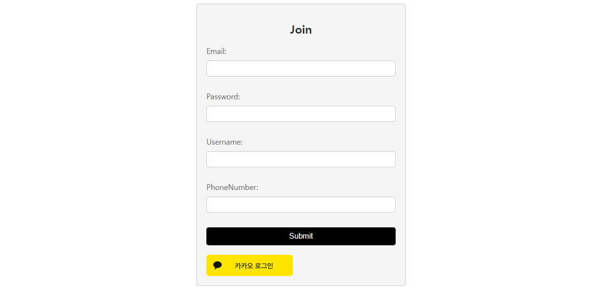
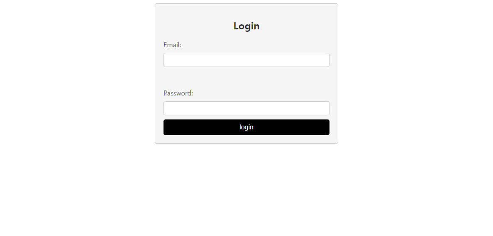
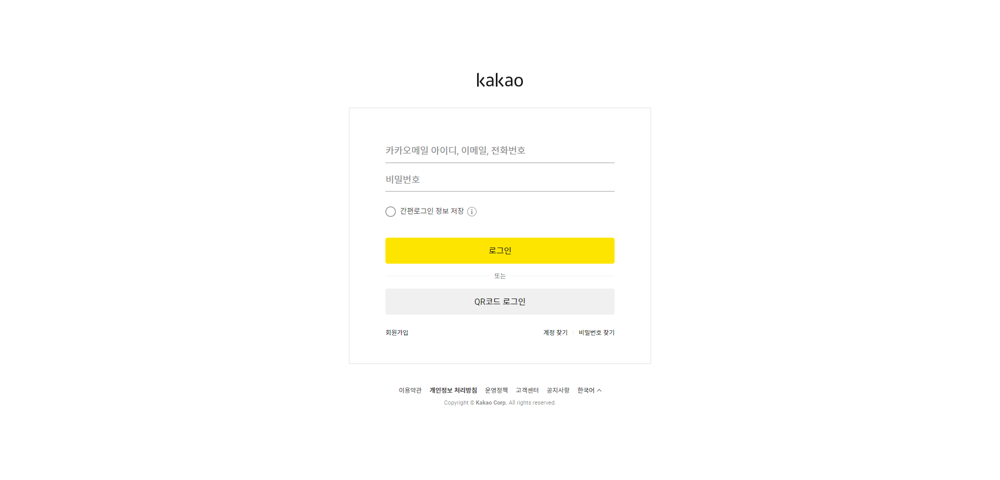
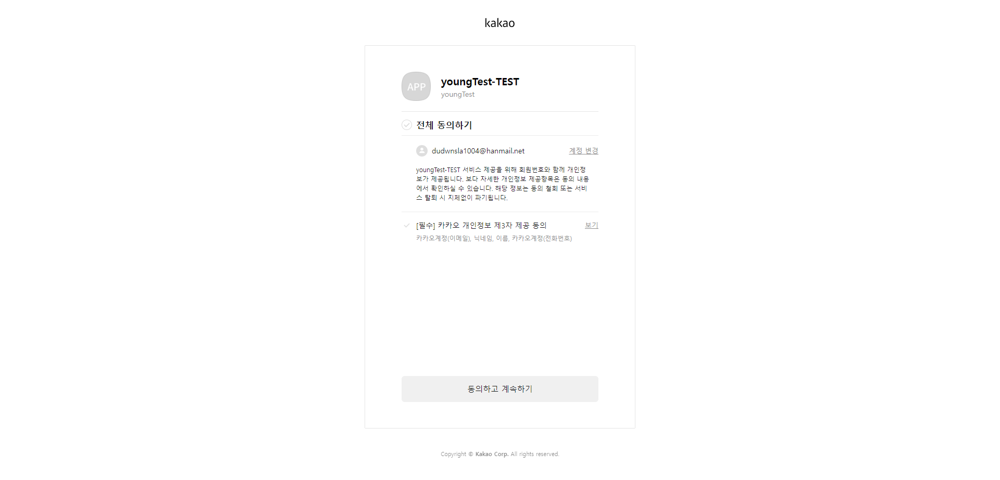

# 🌱 Spring boot login
Spring boot로 Login /Join 구현하기 
KakaoLogin Rest Api 로그인 연동

  
## 개발환경
- IDE: IntelliJ IDEA Community
- Gradle - Groovy, Java 17
- Jar 11
- Spring Boot 2.7.6
- jvm.convert 3.3.2
- JDK 11
- mysql 8.0.35
- Lombok
- Spring Web
- Spring Data JPA
- Thymeleaf
  

## 로그인/회원가입 주요 기능(일반회원)

### 1.회원가입(/join)
  - 이메일, 비밀번호, 사용자 이름, 전화번호

### 2. 로그인(/login)
  - 이메일, 비밀번호

### 3. 이메일중복확인(/ckeck)
  

## 카카오톡 회원가입/로그인

### 1. 카카오톡로 회원가입 및 로그인(/kakao/callback)

### 2. 카카오톡 인증코드 발급(/kakao/oauth)

### 3. 카카오톡으로 로그아웃(/kakao/logout)

  
## 버전

### v1.5.2 (2023.12.07)
- [추가] 로그인 뷰 구현

### v1.4.2 (2023.11.17)
- [수정] 코드 리팩토링
- [추가] 에러 뷰 작업

### v1.3.1 (2023.11.16)
- [추가] 로그아웃(/kakao/logout)
- 코드 리팩토링

### v1.2.0 (2023.11.07)
- 카카오 로그인으로 받아온 사용자 정보로 홈페이지 회원가입 완료
- provider 데이터로 일반회원, 소셜회원 구분

### v1.1.0 (2023.11.06)
- [추가] 카카오톡 인증코드 발급(/kakao/oauth)
- [추가] 카카오 로그인(/kakao/callback)
- [추가] 사용자 정보 가져오기
- h2 데이터베이스 연동

### v1.0.0 (2023.11.01)
- [추가] 이메일중복확인(/ckeck)
- [추가] 일반 회원가입(/join)
- [추가] 일반 로그인(/login)
